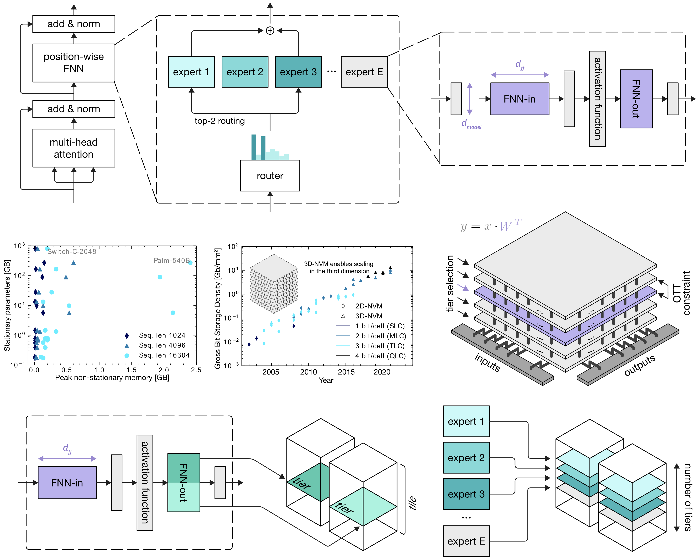

# Analog MoE

### Julian Büchel, Athanasios Vasilopoulos, William Andrew Simon, Irem Boybat, HsinYu Tsai, Geoffrey W. Burr, Hernan Castro, Bill Filipiak, Manuel Le Gallo, Abbas Rahimi, Vijay Narayanan, Abu Sebastian

_Nature Computational Science, 2024_ [[Article]](http://example.com) [[Preprint]](http://example.com)

<div align="center">
  
</div>

Analog MoE is a library that contains GPU kernels for MoE operations extended with hardware-aware training capability. It supports [AIHWKIT-Lightning](https://github.com/IBM/aihwkit-lightning) and [AIHWKIT](https://github.com/IBM/aihwkit). The recommended library to use is AIHWKIT-Lightning. The results from this paper were obtained using AIHWKIT because AIHWKIT-Lightning did not exist yet.

## Requirements
You need to have a GPU which is at least Volta (V100, A100, H100) since this package leverages triton.

## Getting started 🚀
You can create a clean environment using the following
```
conda create -n torch-nightly python=3.10 -y
conda activate torch-nightly
conda install pytorch torchvision torchaudio pytorch-cuda=12.1 -c pytorch-nightly -c nvidia
conda install -c conda-forge aihwkit-gpu -y
pip install triton transformers datasets
```
Now, you should be able to call `python test_moe_layer.py` and the script should exit without any errors.

## Usage ⚒️
You can convert any aihwkit model and swap out the `SigmaMoELayer`s like so:
```
model = convert_to_analog(
    model,
    rpu_config=<some_rpu_config>,
    conversion_map={
        torch.nn.Linear: AnalogLinear,
        SigmaMoELayer: AnalogSigmaMoELayer
    }
)
```

## Note on `torch.compile`
This layer supports `torch.compile` except when input range learning is enabled since the first `rpu_config.pre_post.input_range.init_from_data`
many samples coming into the layer are used to update the input range in-place which is not supported in torch dynamo.

## License 🔏
Please see the LICENSE file.